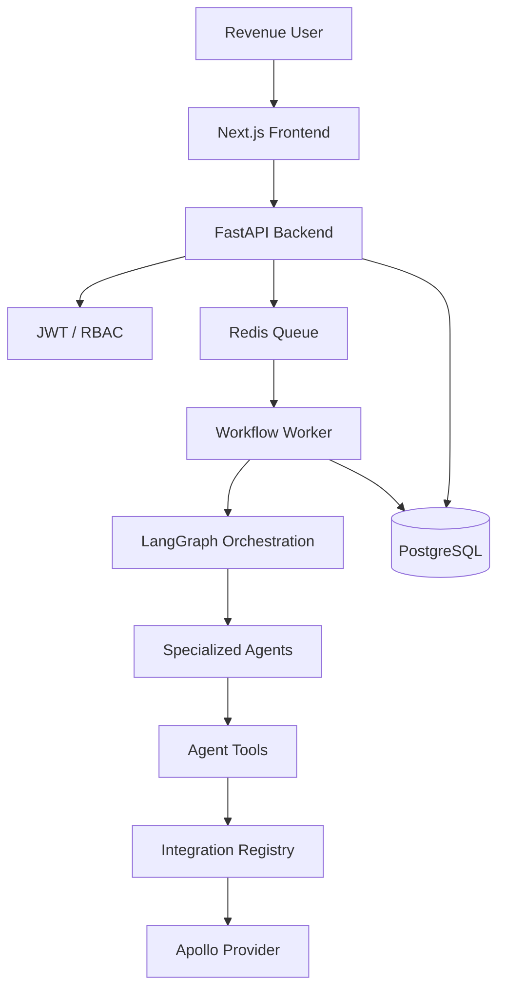

# Architecture

### System Overview

The platform is an AI-native GTM operating layer, built with a modular monolith architecture. It integrates relational GTM data, agentic workflows, and external data providers into a unified system.

### Component Interactions

- **Frontend (Next.js):** A TypeScript thin client that interacts with the backend via REST APIs. It handles user interactions, dashboard visualization, and workflow monitoring.
- **Backend (FastAPI):** The core API layer. It manages authentication (JWT/RBAC), tenant context, and business logic. It delegates long-running tasks to the worker layer.
- **Database (PostgreSQL):** The relational system of record. It stores tenants, users, accounts, contacts, signals, workflow runs, and audit logs.
- **Cache & Queue (Redis):** Used for rate limiting, distributed locking, and as a job queue for asynchronous workers.
- **Worker (Python):** Background processes that consume jobs from Redis. They execute long-running Prospecting workflows and integration syncs.

### Docker Architecture

The system is fully containerized using Docker Compose:
- `db`: PostgreSQL 16
- `redis`: Redis 7
- `backend`: FastAPI application
- `frontend`: Next.js application
- `worker`: Background job processor (sharing the backbone codebase)

## Data Model

The platform uses a unified GTM data model with PostgreSQL as the source of truth. Every tenant-owned table includes a `tenant_id` for mandatory isolation.

### Key Entities

- **Tenants:** Organization boundaries.
- **Accounts:** Organizations targeted for GTM activity.
- **Contacts:** Individuals associated with accounts.
- **Opportunities:** Sales pipeline stages and values.
- **Activities:** Historical interactions (emails, calls, meetings).
- **Signals:** Intent indicators (website visits, signal strength).
- **WorkflowRuns:** Tracking of agentic process execution, including steps and status.
- **Integrations:** Configuration and status of external provider connections.

### Relationships & Indexing

- **Tenant Isolation:** Composite indexes on `(tenant_id, id)` are standard for all tenant-owned entities.
- **Uniqueness:** Tenant-scoped uniqueness (e.g., `tenant_id`, `domain` for accounts) ensures data integrity within organizations.
- **Time-Series:** Time-based indexes on `observed_at` (signals) and `created_at` (activities/audit logs) optimize historical retrieval.

## Multi-Tenancy

Isolation is enforced at multiple layers:

1.  **Request Layer:** JWT claims contain `tenant_id`. FastAPI dependencies derive and set the `TenantContext`.
2.  **Service Layer:** All service methods require a `TenantContext` and authorize permissions before invoking repositories.
3.  **Database Layer:** Repositories apply mandatory `WHERE tenant_id = :tenant_id` filters to all queries. Unique constraints are always composite with `tenant_id`.

## Service/Module Boundaries

The codebase is organized into logical modules under `backbone/app`:
- `api`: HTTP routing and request validation.
- `services`: Business logic and workflow orchestration.
- `repositories`: Tenant-safe database access.
- `agents`: LangGraph workflows and LLM logic.
- `integrations`: External provider adapters.
- `models`: SQLAlchemy schema definitions.

## Agent Orchestration

The platform uses **LangGraph** to model complex, multi-step agent workflows.

- **Workflow Engine:** Manages state transitions between specialized nodes.
- **State Transitions:** Nodes pass a typed state object, allowing for conditional branching and resumability.
- **Tool-Planned Agents:** Agents use LLM-driven planning to select and invoke tools (e.g., `get_icp`, `search_provider_accounts`).

## Integration Framework

The **Provider Registry Pattern** allows for pluggable external integrations.

- **Registry:** Manages available providers and their configurations.
- **Apollo Integration:** A fully implemented provider for account/contact sourcing and enrichment.
- **Unified Interface:** All providers implement a common interface for auth, search, and sync.

## Extension Points

The backbone is designed to support future modules:
- **Engage:** Extending outreach drafts into real email/calendar sequencing.
- **Manage:** Pipeline forecasting and opportunity management.
- **Operate:** Advanced audit exports and compliance governance.

## Tradeoffs & Deferred Work

- **PostgreSQL RLS:** Row-Level Security was deferred in favor of application-layer repository filters for simpler initial review.
- **SSO:** Production SAML/OIDC is deferred; local JWT issuance is used for the challenge.
- **Vector Store:** ChromaDB is planned for semantic retrieval but currently uses relational grounding.

## Next Steps

1.  **Full Vector Grounding:** Implement the ChromaDB bridge for all agent tool calls.
2.  **Advanced Approvals:** Multi-user approval workflows with detailed diffing.
3.  **HubSpot Integration:** Add the second major CRM provider to prove registry extensibility.
