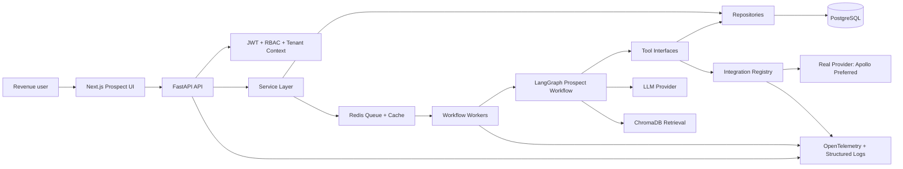
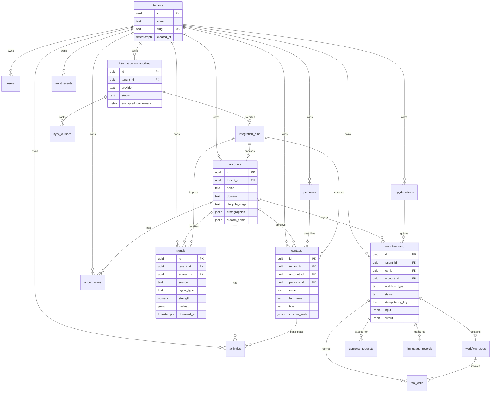
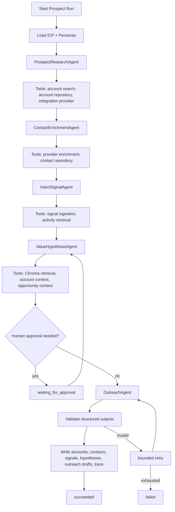
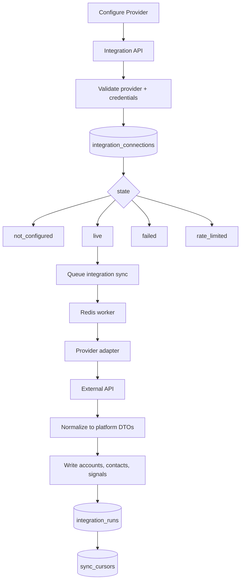

# Architecture

## System Overview

The platform is an AI-native GTM operating layer, not a CRM with a chat panel. Current agentic GTM platforms position around unified customer data, workflow execution, connected signals, and agents grounded in the business data model. This architecture follows that pattern: PostgreSQL is the GTM system of record, LangGraph runs durable agent workflows, integrations normalize external data into platform entities, and the Prospect slice proves the backbone end to end.

Major runtime paths:

- User actions enter through the Next.js Prospect UI and typed FastAPI endpoints.
- API dependencies validate JWTs, derive tenant context, enforce RBAC, validate request DTOs, and propagate trace/correlation IDs.
- Services own business workflows and call repositories, integration services, or workflow enqueue APIs.
- Long-running Prospect and integration work is queued through Redis-backed workers and persisted as workflow records.
- LangGraph executes the Prospect workflow through typed agent state and tool contracts.
- PostgreSQL stores source-of-truth GTM entities, workflow state, integration provenance, traces, usage, and audit events.
- ChromaDB stores retrieval embeddings only and rehydrates authoritative records from PostgreSQL by tenant and entity ID.

## Service Boundaries

The first challenge uses a modular monolith to keep local bring-up simple while preserving extractable module boundaries.

| Module | Responsibility | May depend on | Must not do |
| --- | --- | --- | --- |
| `api` | HTTP routing, auth dependencies, request validation | `services`, `contracts`, `core` | Business logic, direct DB access |
| `core` | config, security, tenancy, rate limiting, errors | stdlib, framework primitives | Domain workflows |
| `contracts` | API DTOs, events, agent/tool/workflow/integration contracts, responses | pydantic/types | Persistence or network calls |
| `models` | SQLAlchemy tables and relationships | SQLAlchemy | Business decisions |
| `repositories` | Tenant-scoped database access | `models`, `storage`, `contracts` | Auth policy decisions |
| `services` | Use cases, authorization, orchestration entry points | repositories, integrations, agents | Raw SQL string construction |
| `agents` | LangGraph workflows, prompts, agent state, tool binding | contracts, tools, observability | Direct DB/provider access |
| `integrations` | Provider registry, provider auth, sync, normalization | contracts, services, observability | Prospect-specific business rules |
| `storage` | DB sessions, Redis clients, Chroma clients | drivers | Domain logic |
| `observability` | logs, spans, metrics, audit helpers | OpenTelemetry/logging | Business branching |

This boundary is intentionally conservative. Engage, Manage, and Operate can add services, workflows, tools, UI routes, and entity-specific APIs without changing the core service pattern.

## Data Model

PostgreSQL is the system of record. Every tenant-owned table includes `tenant_id`, timestamps, and audit metadata where relevant. Core extensibility uses `custom_fields` JSONB with schema governance rather than one-off columns.

Key planned entities:

| Entity | Owner | Purpose |
| --- | --- | --- |
| `tenants`, `users` | Platform | Organization boundary, user identity, role and permission assignment |
| `accounts`, `contacts`, `opportunities` | Tenant | Core GTM graph and future Engage/Manage foundation |
| `activities`, `signals` | Tenant | Timeline events, intent, engagement, enrichment, and workflow inputs |
| `icp_definitions`, `personas` | Tenant | Prospect targeting and messaging context |
| `workflow_runs`, `workflow_steps` | Tenant | Durable async workflow execution and status history |
| `approval_requests` | Tenant | Human-in-the-loop checkpoints and overrides |
| `tool_calls` | Tenant | Agent tool invocation inputs, outputs, status, and timings |
| `integration_connections`, `integration_runs`, `sync_cursors` | Tenant | Provider auth state, sync execution, provenance, and incremental ingestion |
| `audit_events` | Tenant/platform | Security and compliance event log |
| `idempotency_keys` | Tenant | Duplicate prevention for retries and user resubmits |
| `llm_usage_records` | Tenant | Model, token, cost, and latency tracking |
| `custom_field_definitions` | Tenant | Governs validation, UI rendering, extensibility, and query behavior for `custom_fields` JSONB |

`custom_field_definitions` fields:

- `id`
- `tenant_id`
- `entity_type`
- `field_name`
- `field_type`
- `validation_rules`
- `default_value`
- `metadata`

Custom fields are not an uncontrolled JSON escape hatch. Tenant-defined fields must be declared before they are validated, rendered in UI, or used in query/filter surfaces.

Indexing decisions:

- Composite indexes on `(tenant_id, id)` for tenant-owned entities.
- Tenant-scoped unique indexes such as `(tenant_id, domain)` for accounts and `(tenant_id, email)` for contacts where data quality permits.
- Time-series indexes on `(tenant_id, observed_at)` for signals and `(tenant_id, created_at)` for activities, workflow runs, tool calls, and audit events.
- Provider lookup indexes on `(tenant_id, provider, status)` for integration connections and runs.
- JSONB GIN indexes only for stable custom-field query paths identified by product use, not by default on every JSONB column.

Schema assumptions before migrations:

- Core tenant-owned relationships must use tenant-aligned foreign keys or equivalent database constraints.
- Mandatory tenant-aligned constraints apply to accounts, contacts, opportunities, activities, signals, workflow runs, workflow steps, integration runs, tool calls, and approval requests.
- Exceptions require explicit documentation in the migration or schema comment explaining why tenant alignment is not enforceable at the database layer and what compensating control exists.
- Source provenance fields are required on imported/generated records where review ambiguity is possible: `source_provider`, `source_type`, `ingestion_timestamp`, and `source_record_id`.
- `source_type` distinguishes `seeded`, `imported`, and `generated` data.

## Multi-Tenancy

Tenant isolation is enforced in layers:

- Request layer: validated JWT claims include `tenant_id`, user ID, roles, and permissions. Request context carries tenant and correlation IDs.
- Service layer: use-case methods authorize role/permission scope before accessing data or starting workflows.
- Repository layer: every tenant-scoped repository requires tenant context and applies tenant filters by default.
- Data layer: tenant-owned tables include `tenant_id`; uniqueness is tenant-scoped; tenant alignment is enforced through composite foreign keys or explicit constraints where practical.
- Vector layer: Chroma metadata includes `tenant_id` and source entity IDs; retrieval filters by tenant and rehydrates from PostgreSQL.
- Test layer: negative tests attempt cross-tenant reads/writes through API and repositories.

PostgreSQL Row Level Security is deferred for this challenge. The justification is review simplicity and avoiding fragile session-context mistakes while the schema and repository layer are still being established. The compensating controls are mandatory `tenant_id` on tenant-owned tables, tenant-aligned foreign keys for core relationships, tenant-scoped unique constraints, repository guard enforcement, service-layer authorization, request-derived tenant context, and negative isolation tests at API and repository layers. Migrations assume shared tenant-owned tables with composite tenant constraints; adopting RLS later must be additive and must not change entity ownership or service boundaries.

## Agent Layer

The Prospect workflow is a LangGraph state machine. It runs outside request handlers through Redis-backed workers and persists workflow status, steps, tool calls, validation results, and cost metrics.

Traceability captures decision summaries, rationale summaries, inputs, outputs, tool calls, state transitions, validation results, final decisions, and database writes. It must not require hidden chain-of-thought or private reasoning logs.

Minimum v1 trace redaction policy:

- Redact API keys, tokens, credentials, authorization headers, cookies, and secrets before persistence.
- Mark PII fields, generated outreach, and provider payloads in trace metadata.
- Persist decision summaries, tool calls, inputs, outputs, state transitions, validation results, and final decisions.
- Do not expose hidden chain-of-thought or private reasoning logs.

Agent design constraints:

- Agents call tools through typed contracts, not direct repositories or provider SDKs.
- Each node validates structured output before state advances.
- Retries are bounded and reason-coded.
- Human checkpoints can pause the workflow as `waiting_for_approval`.
- LLM usage records capture model, tokens, estimated cost, duration, and workflow step.
- Prompt files live with agent code and are referenced in `docs/agents.md`.

Ownership rules:

- Services own use-case logic, authorization, workflow start, workflow pause, workflow resume, and workflow cancellation.
- LangGraph owns workflow progression and state transitions after a workflow has started.
- Tools own bounded side effects through approved service/repository/integration interfaces.
- Repositories own persistence only.
- Business logic must not leak into routes, repositories, or provider adapters.

Workflow contracts planned before implementation:

| Contract | Payload | State transition | Validation |
| --- | --- | --- | --- |
| `workflow_start` | tenant, actor, workflow type, ICP, target scope, idempotency key | none -> `queued` | actor can start workflow; idempotency key is unique per tenant |
| `workflow_pause` | workflow ID, reason, checkpoint | `running` -> `waiting_for_approval` | workflow belongs to tenant; checkpoint is pausable |
| `workflow_resume` | workflow ID, approval ID, reviewer decision | `waiting_for_approval` -> `running` | approval is approved and not expired |
| `workflow_cancel` | workflow ID, actor, reason | `queued`/`running`/`waiting_for_approval` -> `cancelled` | actor can cancel; run is not terminal |
| `workflow_complete` | workflow ID, output summary, terminal status | `running` -> `succeeded`/`failed`/`timed_out` | terminal output validates against workflow schema |

Human-in-the-loop approval model:

- Approval states are `pending`, `approved`, `rejected`, and `expired`.
- Approval records persist reviewer, timestamp, reason, workflow ID, workflow step ID, and decision payload.
- Minimum v1 workflow: agent creates a pending approval, UI displays the review item, reviewer approves or rejects, workflow resumes or stops with a reason-coded state.

## Integration Framework

The platform implements one real Prospect-powering provider, preferably Apollo. If Apollo credentials or API access are impractical, another real provider can be used if it satisfies the same provider contract and materially powers Prospect.

Provider adapter contract:

- `validate_connection`
- `auth_type`
- `required_scopes`
- `refresh_credentials`
- `plan_sync`
- `fetch_accounts`
- `fetch_contacts`
- `fetch_signals`
- `normalize`
- `rate_limit_policy`
- `retry_policy`
- `health`

Integration runs persist provider, request metadata, status, errors, imported/updated/skipped counts, and data provenance. README and UI must distinguish seeded demo data from live provider data.

Supported auth variants:

- `api_key`: static secret supplied by environment or tenant configuration; used by Apollo, Hunter, and some enrichment providers.
- `oauth2`: access token, refresh token, scopes, expiry, refresh behavior, and connection health; used by HubSpot and Gmail.
- `manual_config`: non-secret provider configuration or reviewer-provided local settings.

Provider compatibility examples:

- Apollo: `api_key`, account/contact search and enrichment.
- HubSpot: `oauth2`, CRM account/contact import.
- Hunter: `api_key`, email discovery/enrichment.
- Gmail: `oauth2`, future Engage activity/email context.

## Async Execution

Redis-backed workers execute workflows and integration syncs. PostgreSQL tracks durable status.

Workflow statuses:

- `queued`
- `running`
- `waiting_for_approval`
- `succeeded`
- `failed`
- `cancelled`
- `timed_out`

Policies:

- Retries use bounded exponential backoff with provider-aware retryability.
- External calls have per-call timeouts; workflow runs have overall time budgets.
- Idempotency keys prevent duplicate workflow starts and duplicate writes.
- Cancellation prevents new steps and ignores late external outputs.
- Backpressure uses queue depth, per-tenant rate limits, worker concurrency limits, and lightweight admission control.

Job states:

- `pending`
- `running`
- `completed`
- `failed`
- `timed_out`
- `cancelled`

Workflow recovery:

- A watchdog detects stuck jobs by heartbeat age and configured timeout.
- The watchdog marks expired jobs `timed_out`, releases workflow locks, emits telemetry, and writes audit events.
- Retry policy uses bounded exponential backoff with retryable error classification.
- Timeout policy is configured per workflow type, workflow step, and external call.

Admission control:

- Per-tenant concurrent workflow limits are configurable.
- Queue thresholds are configurable globally and per workflow type.
- Accepted-but-delayed starts return `202` with workflow status and polling metadata.
- Saturated tenants or queues return `429` with retry guidance.
- Quota values remain configuration, not hardcoded logic.

## Security

Security baseline:

- JWT validation at API boundaries.
- RBAC enforced in service methods.
- Tenant isolation at request, service, repository, database, vector, and test layers.
- Secrets only through environment variables.
- Integration tokens encrypted at rest.
- SQLAlchemy parameter binding only; no string-built SQL.
- Pydantic request/response validation.
- Outbound allowlist for registered integration provider base URLs to reduce SSRF risk.
- Explicit CORS origins.
- Per-user and per-tenant rate limits.
- Audit events for auth, integration configuration, workflow execution, approval, data export, and privileged changes.
- Frontend avoids unsafe HTML rendering and treats API text as untrusted.

Data lifecycle policies are designed before implementation: trace redaction, PII classification, retention rules, encrypted token storage, and immutable audit logs.

Centralized audit contract:

- Audit service owns event creation, event formatting, and event persistence.
- Audit sources include services, workers, agents, integrations, and approvals.
- Audit event fields are `event_id`, `tenant_id`, `actor`, `action`, `resource`, `timestamp`, and `metadata`.
- Audit events are not general telemetry; they record security, compliance, and user-significant state changes.

## Observability

Required log fields:

- `trace_id`
- `correlation_id`
- `tenant_id`
- `request_id`
- `workflow_id`
- `service`
- `status`
- `duration`

Span naming uses `service.operation`, for example:

- `api.prospect.start`
- `worker.workflow.execute`
- `agent.value_hypothesis.run`
- `tool.integration.search_accounts`
- `integration.provider.request`
- `db.accounts.query`

Required metrics:

- `api_requests_total`
- `api_request_duration_ms`
- `workflow_runs_total`
- `workflow_duration_ms`
- `workflow_step_duration_ms`
- `agent_runs_total`
- `agent_tokens_total`
- `agent_cost_usd`
- `tool_calls_total`
- `tool_call_duration_ms`
- `integration_requests_total`
- `integration_rate_limited_total`
- `db_query_duration_ms`
- `errors_total`

Telemetry captures operations and performance. Audit logs capture user, security, and compliance events. They are intentionally separate.

Metric cardinality rules:

- Allowed low-cardinality labels: `service`, `provider`, `status`, and `model`.
- Do not use `tenant_id`, `workflow_id`, `trace_id`, or `request_id` as metric labels.
- High-cardinality values belong in structured logs and distributed traces.

## Extension Points

- New product modules add services, workflow graphs, tool contracts, UI routes, and entity-specific APIs.
- New integrations register provider adapters without changing Prospect core logic.
- New agents compose LangGraph nodes over the same workflow, trace, tool, and approval contracts.
- Custom fields support tenant-specific extension while preserving typed core entities.
- Additional retrieval indexes can be added without moving source-of-truth records out of PostgreSQL.

Future modules:

- Engage uses contacts, activities, outreach drafts, approval requests, email/calendar integrations, and workflow runs.
- Manage uses opportunities, activities, signals, account plans, conversation summaries, and forecast workflows.
- Operate uses integration health, audit events, tenant admin, quotas, workflow policies, and compliance exports.

## Tradeoffs and Deferred Decisions

Accepted tradeoffs:

- Modular monolith first, because the challenge needs strong boundaries and simple review bring-up more than distributed services.
- PostgreSQL shared tables with tenant enforcement, because database-per-tenant is operationally heavy for the first challenge.
- ChromaDB retrieval-only, because PostgreSQL must remain the auditable system of record.
- Redis-backed workers, because they fit the chosen stack without introducing a new major service.

Deferred decisions:

- PostgreSQL RLS is deferred for this challenge with compensating tenant constraints, repository guards, service authorization, and negative isolation tests.
- Production SSO/SAML, SCIM, and identity lifecycle.
- Full CRM two-way sync and conflict resolution.
- Cloud IaC, managed queues, autoscaling, and production secret management.
- Automated retention enforcement and audit export.

## Staff Architecture Review

Findings:

- Service boundaries are clear and extractable. The main risk is accidental dependency leakage from agents or routes into repositories. Contract-first implementation and import discipline are required.
- The data model is broad enough for Prospect and future Engage/Manage/Operate modules. The schema must avoid using JSONB as an escape hatch for core relationships.
- Redis-backed workers resolve the largest execution risk for long-running workflows. The worker lifecycle must be implemented before deep agent behavior.
- Integration provider neutrality is correct. The first provider must still be real and shown through persisted `integration_runs`.
- Deployment strategy is appropriate for review: Docker Compose now, stateless API and horizontally scalable workers later.

Required fixes before implementation:

- Define contract files before routes/services.
- Decide RLS adoption or documented deferral before writing migrations.
- Define idempotency and workflow status transitions in contracts.

## Principal Engineer Review

Weaknesses:

- The architecture is ambitious for a challenge. The implementation must protect the core path: schema, contracts, workflow trace, one provider, and Prospect loop.
- Observability can become noisy unless helper APIs centralize log/span/metric emission.
- Human approval checkpoints can be overbuilt. For v1, approval can be persisted and surfaced in UI without complex collaboration features.
- Custom fields need governance. Without schema definitions, JSONB can become untyped storage.

Exact mitigations:

- Keep UI minimal and spend effort on backbone evidence.
- Build one happy-path workflow plus bounded failure states rather than many shallow features.
- Add `custom_field_definitions` if custom fields become queryable in Phase 2.
- Add tests for tenant isolation and workflow idempotency early.

## Scalability Review

Scalability modeling covers expected load, peak load, growth scenarios, and a 100k concurrent user stress scenario. The local submission is not claiming production readiness for 100k concurrent users.

Expected v1 load:

- Tens of tenants.
- Hundreds to thousands of accounts per tenant in seeded/demo-scale review.
- Prospect workflows run asynchronously and are limited by LLM/provider quotas.

Growth scenario:

- Stateless API replicas scale behind a load balancer.
- Workers scale horizontally by queue depth and provider/tenant limits.
- PostgreSQL becomes the first bottleneck through connection count, hot tenant indexes, and large signal/activity tables.
- Redis queue depth and worker concurrency control backpressure.
- LLM and integration provider rate limits become external bottlenecks before CPU.
- Chroma retrieval requires strict tenant filtering and eventual rebuild jobs.

Stress scenario: 100k concurrent users

- API must remain stateless with external session/auth state.
- DB connection pooling must cap connections and use read/query optimization.
- Workflow starts must be queued; synchronous LLM/provider calls from API would fail this scenario.
- Per-tenant and per-user rate limits protect shared infrastructure.
- Observability volume must be sampled for telemetry while audit events remain durable.

Likely bottlenecks:

- PostgreSQL connection limits and high-cardinality tenant queries.
- External integration and LLM rate limits.
- Queue depth under bursty workflow starts.
- Trace storage growth from tool calls and workflow steps.

Phase 1 conclusion:

The architecture is credible for the challenge if implementation stays disciplined: contracts first, tenant isolation early, async workflow foundation before agents, one real provider, and traceable Prospect execution over UI breadth.

## Research Notes

Market scan references used to validate category framing:

- Crono describes an agentic sales engine connecting signals, data, workflows, and AI agents into an execution layer: https://www.crono.one/
- Pathbound positions around unified customer data and deployable AI agents over customer workflows: https://pathbound.io/
- Alysio describes unified GTM data and workflows across existing revenue tools: https://alysio.ai/
- Lightfield positions AI-native CRM around customer memory and agentic data import: https://lightfield.app/
